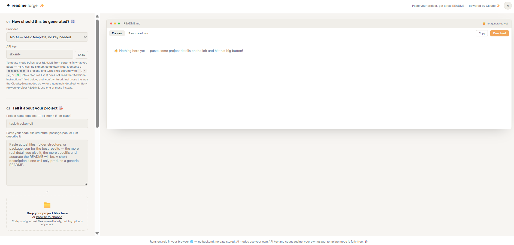
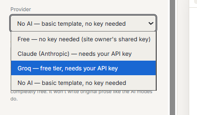
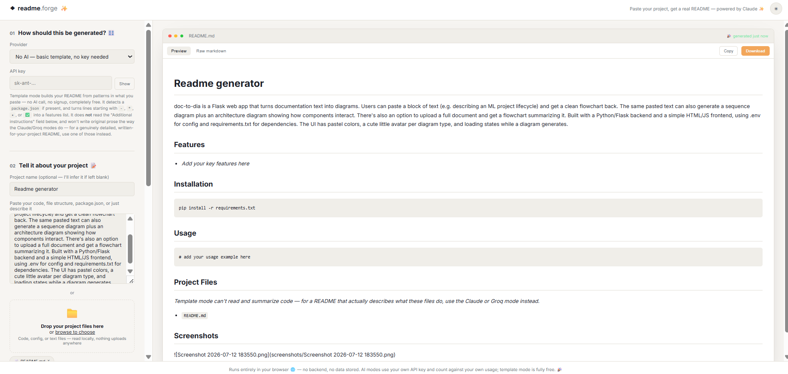
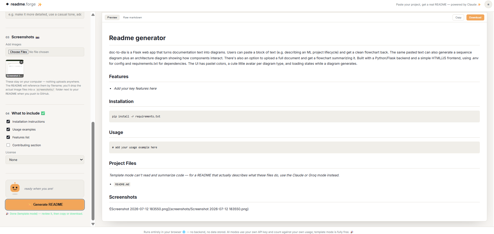

# readme.forge — AI-Powered Project README Generator

Built this a while back mostly for fun, then completely forgot to actually
push it anywhere — found it again and figured it was worth sharing rather
than let it sit on a hard drive forever. Better late than never.

Paste your code, file structure, or a plain-English description of your
project, and this generates a real `README.md` for it.

## Screenshots







Three ways to generate it — pick whichever fits:

| Mode | Cost to visitor | Signup needed by visitor | Quality |
|---|---|---|---|
| **Free (no key)** | Free | No | Good — but capped by the site owner's daily limit |
| **Claude (Anthropic)** | Pay-as-you-go API credit | Yes | Best — original, well-structured prose |
| **Groq** | Free tier available | Yes | Good — fast, free-tier friendly models |
| **No AI (template)** | Free | No | Basic — pattern-based, not original writing |

## Zero-key setup (for the site owner — you)

The "Free" mode works by routing requests through a small serverless
function (a **Cloudflare Worker**) that holds *your* Anthropic API key
privately, so visitors never need their own. You only need to do this once.

### 1. Create a Cloudflare account
Go to [dash.cloudflare.com](https://dash.cloudflare.com) and sign up — free,
no credit card required for this.

### 2. Create the Worker
1. In the dashboard sidebar, go to **Workers & Pages** → **Create** → **Create Worker**
2. Give it a name (e.g. `readme-forge-proxy`) → **Deploy**
3. Click **Edit code** — this opens a browser-based code editor
4. Delete the default code, paste in the entire contents of `worker.js`
   (included in this repo) → **Deploy**

### 3. Add your Anthropic key as a secret
1. On your Worker's page, go to **Settings → Variables and Secrets**
2. Add a new secret: name it exactly `ANTHROPIC_API_KEY`, value = your real
   key from [console.anthropic.com/settings/keys](https://console.anthropic.com/settings/keys)
3. Save — this key is now hidden server-side and never exposed to visitors

### 4. (Recommended) Add a daily limit so costs can't run away
1. Go to **Storage & Databases → KV** → **Create a namespace** (call it
   anything, e.g. `readme-forge-limit`)
2. Back on your Worker's **Settings → Bindings**, add a KV binding:
   variable name `LIMIT_KV`, pointing at the namespace you just created
3. Optionally also add a plain text variable `DAILY_CAP` (e.g. `30`) to set
   how many free generations are allowed per day across all visitors —
   defaults to 30 if you skip this
4. Save and redeploy

### 5. Copy your Worker's URL into the front-end
1. Your Worker's URL is shown at the top of its dashboard page — looks like
   `https://readme-forge-proxy.yourname.workers.dev`
2. Open `script.js` in this project, find the line near the top:
   ```js
   const FREE_WORKER_URL = "https://YOUR-WORKER-NAME.YOUR-SUBDOMAIN.workers.dev";
   ```
3. Replace it with your actual Worker URL
4. Push the updated `script.js` to your GitHub repo (or re-upload it)

That's it — the "Free" mode in the provider dropdown now works for anyone
who visits your deployed site, with zero setup on their end.

**A note on cost control**: each free generation uses a small amount of
your own Anthropic credit. The optional daily cap (step 4) is the safety
net — without it, a burst of traffic could run up a bill. Even with it,
keep an eye on usage from [console.anthropic.com](https://console.anthropic.com)
occasionally, especially right after sharing the link somewhere public.

## How it's different from a plain template generator

The two AI modes actually read what you paste and write original content —
inferring your tech stack from a `package.json`, figuring out what your code
does, and writing real prose instead of `[describe your project here]`
placeholders. Template mode is the honest fallback: zero cost, zero signup,
but it works off pattern-matching (detecting a `package.json`, pulling out
bullet points you already wrote) rather than genuine understanding.

## Getting an API key

- **Anthropic**: [console.anthropic.com/settings/keys](https://console.anthropic.com/settings/keys) — usage-based billing
- **Groq**: [console.groq.com/keys](https://console.groq.com/keys) — has a free tier

## Important: you need your own API key for the AI modes

This is a **static site with no backend** — there's no server to hold a
shared API key on. So the AI modes ask you to paste your own key, which is:

- Used only to call the provider's API directly from your browser
- Kept only in the page's memory for that tab — never written to disk,
  never sent anywhere except the provider you picked
- Required each time you visit (it's not remembered between sessions)

**A note on security**: because this is a public static site, anyone who
opens their browser's developer tools while *they* are using the app with
*their own* key could see that key in the network request — that's normal
and only affects the person who pasted their own key in. If you ever want a
version where visitors don't need their own key at all, that requires a
small backend (even a free serverless function) to hold a key server-side —
a reasonable next step if this gets more use. Template mode sidesteps this
entirely, since it makes no external API calls at all.

## Feature: attaching screenshots to the README you generate

Attach image files in the form — they stay on your computer (nothing
uploads anywhere) and show as thumbnails you can remove. The generated
README references them by filename in a `## Screenshots` section, assuming
they'll live in a `screenshots/` folder next to your `README.md`. You still
need to physically place the actual image files in that folder before
pushing to GitHub — this tool can't upload files anywhere on your behalf.

## Two ways to give it your project

You can either **paste** text directly into the box, **or drag and drop
actual project files** (code, config, `package.json`, etc.) onto the
dropzone underneath it — or both at once. Uploaded files are read locally
in your browser via the FileReader API and merged with whatever you typed,
then sent together as the project material. Nothing is uploaded to a
server; files never leave your machine except as part of the AI prompt
itself (for the AI modes) or not at all (template mode).

## The mascot

A little animated character sits above the Generate button and reacts to
what's happening — idle and blinking while waiting, thinking while a
request is in flight, happy and sparkly on success, sad if something goes
wrong. Purely for fun; it has no effect on the generated output.

## How to use it

1. Open `index.html` (or the deployed GitHub Pages link)
2. Pick a mode: Claude, Groq, or No AI
3. If using an AI mode, paste your API key
4. Paste your code, file tree, `package.json`, or just describe your project
5. Optionally attach screenshots, set a project name, choose sections, pick a license
6. Click **Generate README**
7. Review the result, then **Copy** or **Download**

## Run it locally

```bash
python3 -m http.server 8000
# then visit http://localhost:8000
```

## Get a live link

This is a static HTML/CSS/JS site (no Python, no server), so **Streamlit
isn't the right fit** — Streamlit Cloud only hosts actual Streamlit apps
(Python scripts using the `streamlit` library), and this isn't one. Either
of these two work instead:

### Option 1: GitHub Pages (simplest, free, recommended)

1. Push this folder to a GitHub repo
2. Repo **Settings → Pages** → Source: **Deploy from a branch** → pick your
   branch → root
3. Live at `https://your-username.github.io/repo-name/` within a minute or two

### Option 2: Render (also free, a bit more setup)

1. Sign up at [render.com](https://render.com)
2. **New → Static Site**
3. Connect the GitHub repo this project lives in
4. Leave the build command blank (there's no build step) and set the
   publish directory to the repo root
5. Deploy — Render gives you a `https://your-app.onrender.com` link

Either way, the "Free" AI mode still needs its own separate Cloudflare
Worker setup regardless of where the static site is hosted — see the
"Zero-key setup" section above.

## Tech

Vanilla HTML/CSS/JS, no build step. Uses:
- [marked.js](https://marked.js.org/) (via CDN) to render the generated markdown
- The [Anthropic Messages API](https://docs.claude.com/en/api/messages) and/or
  the [Groq API](https://console.groq.com/docs/api-reference) (OpenAI-compatible),
  called directly from the browser depending on the mode picked

## Project structure

```
project-readme-generator/
├── index.html   # the form + preview UI
├── style.css    # design system + layout
├── script.js    # provider logic, template mode, screenshots, rendering
├── worker.js    # Cloudflare Worker for the zero-key "Free" mode (deployed separately)
└── README.md    # this file
```